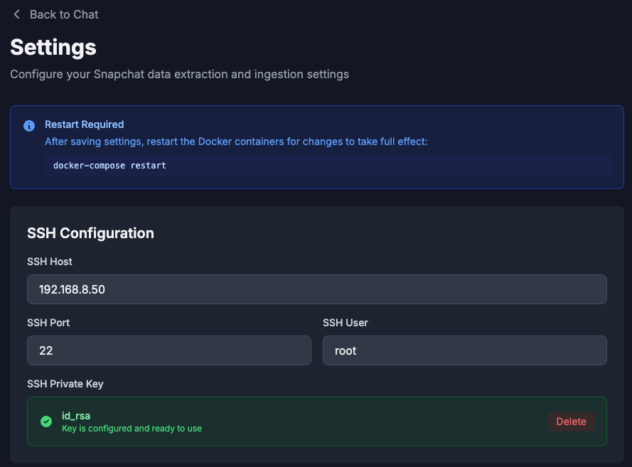

# SnapStash

Do you hate the fact that all your precious Snapchat texts, snaps etc disappear soon after you view them? Do you wish that you could view snaps, messages you recieve without even opening the Snapchat app? This software is for you. 

SnapStash is a comprehensive tool for extracting, saving, and viewing Snapchat data from rooted Android devices. It features a self-hosted web interface for browsing conversations and media, an automated ingestion engine, and a companion iOS application.


**Note:** This project is very WIP and definitely has bugs, if you experience issues please feel free to open one. 

## Features

*   **Automated Extraction:** Connects to Android devices via SSH to pull Snapchat databases and media files.
*   **Unified Viewer:** Browse message history, including text, photos, videos, and voice notes in a clean web interface.
*   **Media Archiving:** Automatically links media files from the cache to their respective messages.
*   **Group Chat Support:** Full support for group conversations and participant mapping.
*   **Search:** Full-text search across all conversations.
*   **Notifications:** Integration with [ntfy.sh](https://ntfy.sh) for real-time alerts on new messages.
*   **Mobile App:** Native iOS companion app built with SwiftUI.

## What is saved (and what isn't)
✓ **All** Chat messages.  
✓ **Recieved** snaps (image and video).  
✓ **Recieved** voice messages.  
✓ **Recieved** Chat media (Sent images and video).  

Note that due to technical limitations, this app **CANNOT SAVE** snaps/media that you send yourself to others, however text chats are saved. 

## Prerequisites

1.  **Rooted Android Device:** You must have root access to `com.snapchat.android` data directories.
2.  **SSH Server:** An SSH server running on the android device(for example [MagiskSSH](https://gitlab.com/d4rcm4rc/MagiskSSH))
3.  **Docker:** Recommended for deployment.

---

## Android Requirements
The main requirement for the android device to be used are that it can A: Run Snapchat and B: Be rooted. It's recommended you do not use this software with your primary device, or if you do set the ingestion speed to something low to conserve battery. 

Launch Snapchat on your chosen device, ensure the screen is set to never turn off, leave the phone plugged in (be careful with this)

## Deployment Guide

The easiest way to run SnapStash is using Docker Compose. This spins up both the Python backend and the Next.js frontend.

1.  **Navigate to the webapp directory:**
    ```bash
    cd webapp
    ```

2.  **Start the Services:**
    ```bash
    docker-compose up -d --build
    ```

3.  **Access the Application:**
    *   **Frontend (UI):** [http://localhost:3067](http://localhost:3067)
    *   **Backend (API):** [http://localhost:8067](http://localhost:8067)

All configuration (SSH, notifications, etc.) is done via the Settings page in the web interface after launch.


## ⚙️ Setup & Configuration

Once the application is running, navigate to the **Settings** page in the web interface to configure the connection to your Android device.



### 1. SSH Configuration

You need to provide the connection details for your Android device.

*   **SSH Host:** The local IP address of your Android phone (e.g., `192.168.1.50`).
*   **SSH Port:** The port your SSH server is listening on (default is `22` for MagiskSSH).
*   **SSH User:** Usually `root`.
*   **SSH Key:** You can upload your private key file (e.g., `id_rsa`) directly through the Settings UI.


### 2. Ingestion Settings

Configure how data is pulled from the device:

*   **Ingest Mode:**
    *   *Continuous:* Runs immediately after the previous run finishes (recommended for fast notifications).
    *   *Interval:* Runs on a fixed schedule (e.g., every 15 minutes).
*   **Extract Media:** Toggle to enable/disable downloading photos and videos (disabling speeds up text-only backups).

### 3. Notifications (Ntfy)

To receive push notifications for new messages:

1.  Enable **Ntfy Notifications**.
2.  Set your Ntfy server URL (default: `https://ntfy.sh`).
3.  Define topics for Media and Text messages.

---

## iOS Application

The project includes a native iOS application (`ios/SnapStashMobile`) built with SwiftUI.

1.  Open `ios/SnapStashMobile/SnapStashMobile.xcodeproj` in Xcode.
2.  Navigate to **Signing & Capabilities** and select your Development Team.
3.  Build and run on your physical device or simulator.
4.  In the app settings, set the **API Base URL** to your backend address (e.g., `http://192.168.1.10:8067`).


## Disclaimer

This software is for educational and archival purposes only. Users are responsible for complying with all applicable laws and Terms of Service.